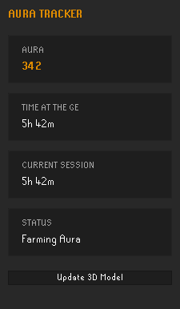

# Aura Tracker

Farm Aura the only way that actually counts: standing dead still on one tile at the
Grand Exchange. Zero skill, zero effort, maximum aura gained while everyone else is out
here moving around like it means something.

The longer you stand still on the same tile inside the Grand Exchange, the more Aura
you accumulate. Leaving the tile, leaving the GE, world hopping, teleporting, or
logging out pause the count. Nothing is lost, but nothing keeps accumulating while you
aren't actually standing still inside the GE.

```
auraPoints = eligibleSecondsElapsed / 60
```

**Check the live leaderboard:** [aura-web-one-green.vercel.app](https://aura-web-one-green.vercel.app)

## Screenshots

<table>
<tr>
<td></td>
<td></td>
<td></td>
</tr>
<tr>
<td align="center">Sidebar panel</td>
<td align="center">Community leaderboard</td>
<td align="center">Player page</td>
</tr>
</table>

The leaderboard screenshot is the real, live production ranking; the player page still shows synthetic demo data, not a real player's account.

## Data and privacy

**Online sync is on by default (opt-out)**, same model as [RuneProfile](https://runeprofile.com):
your display name and Aura total sync to the
[community leaderboard](https://aura-web-one-green.vercel.app) when you log out. Your
character's equipment/appearance can also be exported as a 3D model and shown on your
player page, but only when you click the panel's "Update 3D Model" button. Nothing
about the model is ever exported automatically. Both sync and the model can be turned
off any time in **Config → Aura Tracker**; a one-time chat message explains what's sent
the first time a sync actually happens.

This plugin never reads keyboard, mouse, other players, or anything beyond your own
character's position and appearance.

**The leaderboard is unofficial.** It's a fun community ranking, not a verified
hiscore. Aura is calculated entirely by each player's own client. Treat it as bragging
rights, not proof, the only thing you're really mogging anyone in here is a leaderboard
about standing still.

## Credits

`com.aurafarming.modelexporter` is adapted from the [RuneProfile plugin](https://github.com/ReinhardtR/runeprofile-plugin),
see [THIRD_PARTY_NOTICES.md](THIRD_PARTY_NOTICES.md) for the full license text.

## License

BSD 2-Clause, see [LICENSE](LICENSE).
